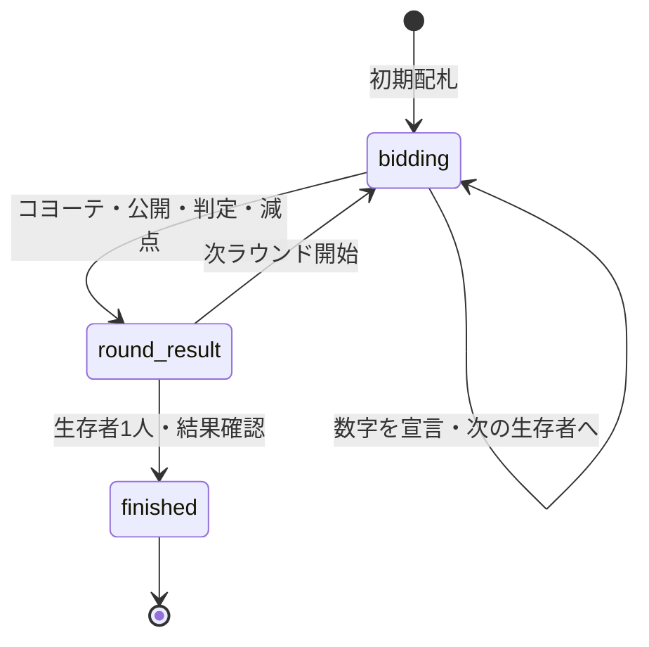

# コヨーテ 実装仕様書

作成日: 2026-09-13 / 対象: Bodobako / 状態: 基本ゲーム実装済み（2026-09-13）

## 1. 目的と初期実装の範囲

既存のオンライン対戦基盤に `coyote` を追加する。自分のカードだけが見えない状況で、数字をつり上げるか「コヨーテ！」で直前の宣言に挑戦する心理戦を、スマートフォンでも迷わず遊べるようにする。

この仕様に基づき基本ゲームを実装。使用済みカード一覧を含み、第1節の対象外機能は実装しない。

| 項目 | 初期実装の決定案 |
| --- | --- |
| 表示名 / ID | コヨーテ / `coyote` |
| 対戦 | 同じルームで2〜10人、それぞれの端末から操作 |
| ルールの基準 | ニューゲームズオーダー日本語版の基本ゲーム。資料で未確認の細部は第4節のアプリ裁定を採用 |
| ライフ | 全人数で3。0で脱落、最後の1人が勝利 |
| カード | 36枚。数字カードと特殊カード4種 |
| 対応画面 | PC・タブレット・スマートフォン縦画面 |
| 含める機能 | ルール説明、カード一覧、全員が確認できる使用済みカード一覧、宣言履歴、判定内訳、脱落者の閲覧、再接続、既存の再戦導線 |
| 対象外（後続実装も不要） | 仮面カード6効果、人数別ライフ設定、CPU、手番制限時間、専用リアクション、外部観戦 |

## 2. 調査結果と出典

調査日: 2026-09-13。公式製品ページ・公式FAQを優先したが、今回確認できた公式ページにはルール全文がなかった。基本進行は日本語版の紹介記事で照合した。海外版・他サービス独自ルールを無条件に混ぜない。

| ID | 出典 | 利用する情報 / 信頼度 |
| --- | --- | --- |
| S1 | [ニューゲームズオーダー公式製品ページ・FAQ](https://www.newgamesorder.jp/games/coyote) | 一次情報。2〜10人、15〜30分、作者。最大値が複数枚でもキツネが0にするのは1枚だけ |
| S2 | [コバのボドゲ棚：コヨーテの紹介](https://tanagaippai.com/games_no-034/) | 二次情報。36枚の内訳、1以上の整数宣言、次ラウンドの開始者、山札補充 |
| S3 | [ぼくボド：コヨーテのルール・遊び方](https://boku-boardgame.net/coyote) | 二次情報。自分だけ非公開、挑戦判定、3ライフ、脱落、最後の1人が勝利 |
| S4 | [にしまるブログ：コヨーテのルール説明](https://nissyblogs.com/%E3%80%90%E3%83%9C%E3%83%BC%E3%83%89%E3%82%B2%E3%83%BC%E3%83%A0%E3%80%91%E3%82%B3%E3%83%A8%E3%83%BC%E3%83%86%E3%81%AE%E3%83%AB%E3%83%BC%E3%83%AB%E8%AA%AC%E6%98%8E%EF%BC%86%E6%84%9F%E6%83%B3/) | 二次情報。特殊カードの基本効果と仮面カードの存在 |
| S5 | [Asoberryのオンライン版ルール](https://coyote.asoberry.com/ja/rules) | 比較用。このサービスは最初の脱落で終了するため、本仕様の終了条件の根拠にはしない |

原作のカード絵や説明書の文章は流用せず、イラスト・説明文は本アプリ用に制作する。公式監修・公認を示す表現は使用しない。

## 3. 基本ルール

### 3.1 準備と進行

- 生存者に山札から1枚ずつ配る。本人には裏面、他プレイヤーには表面を見せる。山札の順序は非公開。[S3]
- 最初の手番はサーバーでランダム選択する（オンライン用の決定）。席順は開始時の `playerIds` 順で固定し、以後その順に循環する。
- 最初の手番は1以上の整数を宣言する。以後は直前より大きい整数の宣言、または直前の宣言への「コヨーテ！」を選ぶ。[S2]
- 数字は場の合計以下だと予想して宣言するが、実際に超えていても宣言できる。サーバーは真の合計を理由に宣言を拒否しない。
- 挑戦が起きるまではカードを配り直さない。自分に手番が戻ってきても同じカードを持つ。

### 3.2 挑戦と勝敗

`B = 直前の宣言値`、`T = 特殊カード解決後の実際の合計` とする。

| 条件 | 挑戦の結果 | ライフを1失う人 |
| --- | --- | --- |
| `B > T` | コヨーテ成功 | 数字を宣言した人 |
| `B <= T` | コヨーテ失敗 | コヨーテを宣言した人 |

同値は宣言者のセーフ。挑戦で全員のカードを公開し、敗者のライフを1減らす。0なら脱落し、以後配札・手番の対象外。生存者が1人になったら優勝。[S3]

### 3.3 次のラウンド

判定で使用したカードを捨て札にし、生存者に新しいカードを配る。敗者が生存していれば敗者から開始する。[S2]

敗者が脱落した場合は、その席から進行方向に見た次の生存者が開始する（アプリ裁定）。席を詰めて並べ直さず、脱落した席は小さく残す。

## 4. カードと計算仕様

### 4.1 デッキ構成

以下の合計36枚を固定する。[S2]

| 種別 | 表記 | 枚数 | 内部表現 |
| --- | --- | ---: | --- |
| 数字 | 1 / 2 / 3 / 4 / 5 | 各4 | `number` |
| 数字 | 10 | 3 | `number` |
| 数字 | 15 | 2 | `number` |
| 数字 | 20 | 1 | `number` |
| 数字 | 0 | 3 | `number` |
| 数字 | −5 | 2 | `number` |
| 数字 | −10 | 1 | `number` |
| 夜 | 0・月のアイコン | 1 | `night` |
| 倍化 | ×2 | 1 | `double` |
| キツネ | MAX→0 | 1 | `fox` |
| ほらあな | ? | 1 | `cave` |

同じ数字のカードも、サーバー内部では別々の `cardId` を持つ。裏面に `?` を使うとほらあなと混同するため、自分の非公開カードは月とコヨーテの紋章で示す。

### 4.2 調査で確認した基本効果

| カード | 効果 |
| --- | --- |
| 夜 | 数値は0。ラウンド後、捨て札も含めて山札を混ぜ直す |
| ×2 | 基本カードの合計を2倍にする |
| MAX→0 | 最大の正のコヨーテ数字カード1枚を0にする |
| ? | 判定時に山札から1枚引き、計算に利用する |

基本効果は[S4]、最大値が同値のとき1枚だけを無効にする裁定は公式FAQ[S1]による。

### 4.3 未確認点と実装用の裁定案

以下の細部は公式ルール全文で裏付けられていない。実装を止めないための**本アプリの裁定案**であり、公式ルールだと断定しない。ルールヘルプの「このアプリでの扱い」にも載せる。原本を確認できた場合は実装前に優先して照合する。

| 未確認点 | 初期実装で採用する裁定案 |
| --- | --- |
| ? から特殊カードを引いた場合 | 引いた1枚の効果も発動する。引き直しはしない。? 自身は場に1枚しかないので再帰しない |
| キツネの対象 | ? の追加数字を含めた正の数字から最大1枚。正の数字がなければ何もしない |
| 同じ最大値のどれを消すか | 固定席順、次に ? 追加札の順で先頭の1枚。合計は変わらないが表示を固定する |
| 計算順 | ? の解決 → キツネの対象決定 → 数字の合計 → ×2 → 夜の次ラウンド処理予約 |
| 合計が負になる場合 | 0に丸めない。宣言の最小値は引き続き1 |
| 通常配札で山札が足りない | 配る前に残り山札と捨て札を混ぜ直し、生存者全員へ配る |
| ? の追加ドロー時に山札が空 | 過去の捨て札だけを混ぜて補充。現在の場のカードは混ぜない |
| 夜のリセット範囲 | 場・追加札・残り山札・過去の捨て札の全36枚。判定が済んでから混ぜる |

### 4.4 配札と山札が空になる場合

オンライン用の裁定として、以下の順序を固定する。

1. 次ラウンド開始時、前ラウンドの場のカードと ? の追加札を捨て札へ移す。
2. 夜が出ていれば、全36枚を回収してシャッフルする。
3. 夜がなく、山札の枚数が生存人数より少なければ、残り山札と捨て札をすべて合わせてシャッフルする。配札の途中で補充せず、全員分を確保してから配る。
4. 山札から生存者に1枚ずつ配る。

例: 生存者5人で山札3枚なら、前ラウンド分も含む捨て札と3枚を混ぜ直してから5枚配る。

山札が生存人数とちょうど同じなら、そのまま配って残り0枚とする。空になっただけでは直ちにリセットしない。次ラウンドの配札前、またはそのラウンドの ? 判定で追加札が必要になった時点で補充する。

? の追加ドロー時に山札が0枚なら、過去の捨て札だけをシャッフルして山札にする。現在の場のカードは回収せず、そのまま判定に使う。36枚・最大10人の本仕様では、この場面で補充用の捨て札は必ず存在する。

いずれの補充もサーバーで1回だけ行い、全員に「山札を混ぜ直しました」と通知する。捨て札一覧の更新も同じ状態更新で配信する。

### 4.5 使用済みカードの公開

全員（脱落済み参加者を含む）が、**現在捨て札にあるカードの種類と枚数**を確認できるようにする。これまでは専用一覧を明示していなかったため、今回必須機能に追加する。

- 対戦画面に「使用済み ○枚」を表示し、タップで一覧を開く。PCでも同じ場所から開ける。
- 一覧は36枚の初期構成と並べ、数字別・特殊カード別に使用済み枚数を示す。0と夜は別枠にする。
- 現ラウンドの配札済みカードは使用済み一覧に入れない。判定中の公開カードは結果欄に表示し、次ラウンド開始時に捨て札へ移したタイミングで一覧に反映する。
- 山札へ戻したカードは使用済み枚数から外す。通常の補充・夜のリセット・? 判定中の補充では捨て札を全回収するため、一覧は0枚になる。
- 一覧に「山札に戻ると使用済み枚数はリセットされます」と常時説明する。過去のログが残っていても、現在の捨て札とは混同させない。
- 再接続時もサーバーの現在の捨て札から一覧を復元する。ローカルログを集計して作らない。
- 公開するのは種類別枚数のみで、内部カードIDや山札順序は含めない。過去に公開されたカードを材料とするプレイヤー自身の推理は妨げない。

### 4.6 サーバー処理の順序

1. 挑戦対象の宣言者・宣言値・挑戦者を固定する。
2. ? がある場合のみ山札の先頭を1枚引き、公開の追加札にする。
3. キツネがあれば正の最大カード1枚の計算値を0にする。
4. 数字カードを合算する。夜・×2・キツネ・? 自体の数値は0。
5. ×2があれば合計を2倍にする。負数にも適用する。
6. 第3.2節で敗者を決め、ライフと脱落順を更新する。
7. 公開カードと計算過程を `roundResult` に保存する。
8. 次ラウンド開始時に回収・補充・シャッフル・配札を行う。結果表示中に配り直さない。

乱数はサーバーでのみ使用し、シャッフル済み山札を永続化する。再接続や `getPlayerView` で再抽選しない。単体テストでは乱数関数または山札を注入する。

### 4.7 計算の受け入れ例

| 場のカード | 追加札 | 最終合計 | 確認すること |
| --- | --- | ---: | --- |
| 10, 5, −5 | なし | 10 | 宣言10への挑戦は失敗、宣言11への挑戦は成功 |
| 15, 3, −5, ×2 | なし | 26 | 減算後に倍化 |
| 10, 10, 3, MAX→0 | なし | 13 | 最大値を2枚とも消さない |
| 20, 5, MAX→0, ×2 | なし | 10 | キツネを先に解決 |
| −10, −5, ×2 | なし | −30 | 負数を丸めない |
| −10, MAX→0 | なし | −10 | 正数がないときキツネは不発（裁定案） |
| 5, ?, MAX→0 | 20 | 5 | 追加札も最大値候補（裁定案） |
| 5, ? | ×2 | 10 | 追加特殊カードの発動（裁定案） |
| 5, ? | 夜 | 5 | 数値0、次回全回収（裁定案） |

## 5. 画面・デザイン

### 5.1 コンセプト「月夜の砂漠のカードテーブル」

夜空、砂丘、月、コヨーテのシルエットで世界観をつくる。操作領域は明瞭なカードゲームとして扱い、装飾を文字や数字の背後に重ねない。原作の絵柄に依存せず、CSSとオリジナルSVGで描画する。

| 用途 | 指定案 |
| --- | --- |
| 夜空背景 | `#101827`。下部へ `#24344A` の弱いグラデーション |
| カード・説明面 | `#F4E7CE`。微かな紙の粒子と細い内枠 |
| カード上の文字 | `#202837` |
| 夜空上の主要文字 | `#F8F3E8` |
| 手番・月・宣言 | `#E8B86B` |
| コヨーテボタン | `#A93226` に白文字。大きな文字と牙のSVG |
| 成功 | `#8DD8BD` と「成功」表記 |
| 失敗・失ったライフ | `#FFB2A3` と「ライフ −1」表記 |
| 文字 | 日本語は既存フォントを使用。数字は等幅数字、太さ700以上 |
| 形状 | カード角丸16px、操作ボタン12px、余白は8px基準 |

プレイヤーのカスタムカラーはアバター周囲に反映し、カードの種類の色・成功失敗の色と役割を分ける。

### 5.2 画面構成

| 画面 / 状態 | 必須要素 |
| --- | --- |
| ロビー | コヨーテ専用サムネイル、2〜10人、短い説明「自分だけ見えない。数字を上げるか、見破るか。」 |
| 待機室 | 他ゲームと同じ既存の参加者・開始導線。コヨーテ独自の説明文は追加しない |
| 対戦中 | 全員の席とカード、現在の宣言、宣言者、手番、ライフ、山札枚数、使用済みカード一覧への導線、直近の宣言履歴 |
| 自分の手番 | 数字入力と増分ボタン、宣言ボタン、コヨーテボタン |
| 相手の手番 | 相手名と「考え中」。カードやヘルプを閲覧可能 |
| 判定 | 全員のカード、? 追加札、計算式、宣言値との比較、敗者、残りライフ、次への操作 |
| 脱落後 | 「観戦中」、生存者のカード、ラウンド進行。操作権はない |
| 最終結果 | 最終ラウンドの内訳、優勝者、脱落順による順位、既存の再戦導線 |
| ヘルプ | 30秒で読める基本説明、カード内訳、特殊カード、アプリ裁定 |

PCはゲーム領域内の上部に相手の席、中央に大きな宣言値、下部に自分の席と操作パネルを配置する。右側の既存サイドバーはプレイヤー一覧とログに使う。相手が多い場合は2段に折り返す。

スマートフォンは相手のカードを3列のグリッドにし、自分のカードと操作パネルをゲーム領域下部に固定する。数字を縮小して全員を無理に1画面へ詰めず、カード領域を縦スクロール可能にする。既存のモバイルタブバーとセーフエリアの分だけ下端を空ける。中央の最新宣言と手番はスクロール中も確認できる配置にする。

席には「名前・カード・ライフ数・手番」を同じ順序で表示する。自分の裏面には「あなたのカード／相手には見えています」。特殊カードは表記に加えて短い効果名を常時表示し、タップで説明を開く。

### 5.3 入力と誤操作対策

- 初回入力は1、以後は `直前値 + 1`。手番またはラウンドの変更で更新する。
- `+1 / +5 / +10` の増分ボタン、減算、直接入力を備える。送信直前に値を再検証する。
- 宣言ボタンは「23を宣言」のように確定値を明記する。
- コヨーテは直前の宣言がある自分の手番だけ有効。「23は多すぎる！」を補助文にする。
- 初手のコヨーテは無効、理由を表示。送信中・切断中・相手の手番・脱落時も操作不可。
- 送信後は応答する状態更新またはエラーまでロック。通信失敗後に挑戦を自動再送しない。
- ブラフを妨げる正解合計・自分の推定カード・成功確率は対戦中に表示しない。
- カード一覧は固定の初期構成と公開の使用済み枚数を表示する。未公開の山札の種類別枚数や、それから逆算した本人カードの情報は送信しない。

### 5.4 演出

| タイミング | 演出案 |
| --- | --- |
| 配札 | 250〜350msのスライド。自分は裏面のまま |
| 宣言 | 180msで数字を切り替え、宣言者から中央へ短い吹き出し |
| 手番 | 金色の枠と「あなたの番」。既存の手番通知音を利用 |
| 挑戦 | 「コヨーテ！」を約350ms表示し、カードを反転 |
| 計算 | ? → キツネ → 合算 → ×2の順に該当カードを強調。全体1.5秒以内 |
| ダメージ | ライフの光を1つ消し、「残り2」と文字でも示す |
| 優勝 | 月の輪とコヨーテのシルエット、控えめな粒子 |

演出はサーバー上の判定を再生するだけ。アニメーション完了で勝敗を決めない。判定画面には「演出をスキップ」を用意し、再接続時は完成した結果を即表示する。`prefers-reduced-motion` では動きを省略する。

### 5.5 デザインの受け入れ条件

- 390×844 / 768×1024 / 1440×900で2人・6人・10人の配置を確認する。
- 320px幅でも横方向にはみ出さず、操作ボタンが隠れない。
- 主要タップ領域44px以上、本文14px以上、カード数字はモバイルでも24px以上を目安とする。
- 通常文字のコントラスト比4.5:1以上を実装時に検証する。
- 色だけで手番・敗北・カード種を区別しない。キーボード操作とフォーカス表示に対応する。
- 非公開カードの数値をalt・aria-label・title・DOM属性に含めない。読み上げは「あなたのカード、非公開」。

## 6. 状態とアクション

### 6.1 状態遷移



配札・計算は1回の状態更新内で完了させる。クライアント演出用のフェーズはサーバーに作らない。

### 6.2 型設計案

```ts
type CoyoteCard =
  | { id: string; kind: 'number'; value: -10 | -5 | 0 | 1 | 2 | 3 | 4 | 5 | 10 | 15 | 20 }
  | { id: string; kind: 'night' | 'double' | 'fox' | 'cave' };

type CoyoteMove =
  | { type: 'bid'; value: number; expectedRevision: number }
  | { type: 'challenge'; expectedRevision: number }
  | { type: 'continue'; expectedRevision: number };
```

| 状態フィールド | 内容 |
| --- | --- |
| `rulesVersion` | `bodobako-coyote-v1`。第4.3節の裁定を含むルール識別子 |
| `phase` | `bidding / round_result / finished` |
| `revision` | 成功した操作ごとに増加。再送・古い操作を拒否 |
| `roundNumber` | 1から開始 |
| `playerIds` | 固定席順。脱落しても削除しない |
| `lives` | プレイヤーID → 0〜3 |
| `currentPlayerIndex` | 宣言中は手番の席、結果中は続行担当者の席 |
| `eliminatedPlayerIds` | 脱落した順 |
| `deck / discard / hands` | サーバー専用。手札は生存者1人1枚 |
| `lastBid` | null または宣言値・宣言者ID |
| `roundBids` | 現ラウンドの公開履歴。再接続でも直近の宣言を復元 |
| `roundResult` | null または公開カード、追加札、無効化対象、計算前後の数値、宣言者・挑戦者・敗者、ライフ変更、夜によるリセット予約 |
| `winnerId` | 優勝確定時のID、それ以外null |

`continue` は次ラウンド開始者だけが実行できる。最終ラウンドでは優勝者が「最終結果へ」を実行する。結果中の担当者は公開直後に確定し、`getCurrentPlayerId` もそのIDを返す。全員の確認を待つ方式にはしない。担当者が接続を失った場合は既存の切断処理に従う。

判定で勝者が確定しても、結果確認前は `getStatus = playing` とし、最終 `continue` で `finished` にする。共通のゲーム終了表示が最終判定を覆わないようにする。各端末の演出はスキップ可能で、進行担当者の「次へ」でサーバー状態が進んだら即座に追従する。

### 6.3 検証と重複対策

`parseMove` はオブジェクト構造、操作種別、有限の安全な整数を確認する。`validateMove` は参加者・生存・フェーズ・手番・revision・前回値との大小を確認する。

- 宣言は `1 <= value <= Number.MAX_SAFE_INTEGER`。真の合計や山札に応じた上限は設けない。
- 最大安全整数に達したら次の人は挑戦だけ可能とし、加算ボタンを無効にする。
- `expectedRevision` は現在値との完全一致が必要。全アクションで必須。
- 不正な操作は状態もrevisionも変更せず、既存のエラー通知経路に載せる。
- `applyMove` は元状態を破壊せず新状態を返す。過去の結果表示に使う配列も共有して書き換えない。

## 7. 秘匿情報と再接続

### 7.1 プレイヤー別ビュー

`CoyoteState` と `CoyotePlayerView` を別に定義する。`getPlayerView` は公開フィールドを明示的に組み立てる。`...state` でサーバー状態を展開してから一部だけ消す方式は使わない。

| 情報 | 宣言中の生存者 | 結果中 | 脱落済み参加者 |
| --- | --- | --- | --- |
| 自分のカード | `{ hidden: true }` のみ | 公開 | 配札なし |
| 他人のカード | 表面情報 | 公開 | 表面情報 |
| 山札 | 枚数のみ | 枚数のみ | 枚数のみ |
| 使用済みカード | 種類別枚数を公開 | 種類別枚数を公開（今の場は結果欄） | 種類別枚数を公開 |
| 山札順序・乱数・サーバー内部ID | 非公開 | 非公開 | 非公開 |
| 直前値・手番・ライフ | 公開 | 公開 | 公開 |
| ? の追加札・真の合計 | 送信しない | 公開 | 宣言中は送信しない |

`CoyotePlayerView` に `discardCounts`（種類別枚数）と `discardCount`（総枚数）を追加し、サーバーの `discard` から生成する。サーバー状態そのものや内部IDは送らない。

不明なプレイヤーIDには手札情報を一切返さない。脱落者は既存ルーム参加者として閲覧し、新規の観戦参加経路は作らない。

カードの公開表示には席IDや表示順を使い、内部 `cardId` を送らない。公開した前ラウンドの `roundResult` も次の配札でクリアする。公開履歴とログだけから未公開の新しい手札を特定できる識別子を残さない。

### 7.2 既存基盤との整合

調査したコードでは、`RoomSession.ts` は開始・更新・再接続で `getPlayerView` を利用する。ログはWorkerで生成しているのではなく、クライアントの `useGameLog.ts` が前後のビューから `getLogEntries` を呼ぶ。

したがって `getLogEntries` と `getCurrentPlayerId` は、**完全なサーバー状態とマスク済みビューのどちらでも必要情報を読める**よう、公開フィールドだけを参照する。宣言ログは宣言値と宣言者、結果ログは公開済み `roundResult` から作る。裏の山札や本人カードにアクセスしない。

共通ログは直近50件のローカル保存で、サーバーによる全履歴復元ではない。現在の宣言履歴は `roundBids`、現在の判定は `roundResult` を正とし、再読み込みでも表示できるようにする。

### 7.3 切断・退出

現状の `RoomSession.alarm()` は既定30秒の切断猶予後に参加者を削除し、対戦中であればルーム全体を「退出」で終了させる。明示退出も対戦終了につながる。

初期実装はこの共通挙動を使う。猶予内の復帰で同じ席・同じ手札・同じ手番を復元する。復帰時は必ず現在のマスク済みビューを送信し、未処理操作は自動再送しない。

脱落者の退出でも、現行基盤では対戦全体が終了する。脱落画面と退出確認には「観戦を続けられます。退出すると対戦が終了します」と案内する。これを改善して脱落者だけ自由に退出できるようにする場合は、ゲーム別の退出処理を共通基盤へ追加する別タスクとする。途中退出時の順位は既存基盤の処理であり、通常の脱落順ランキングとは区別して「退出による終了」を表示する。

## 8. 既存コードへの組み込み

React 19 + TypeScriptのclient、sharedの `GameDefinition`、Cloudflare Durable Objectの既存構成を使用する。通常対戦のための新規APIは不要。

### 8.1 追加するファイル案

```text
packages/shared/src/games/coyote/
  types.ts                  サーバー状態・公開ビュー・カード・操作・判定結果
  cards.ts                  36枚の構成
  logic.ts                  配札・補充・計算・次手番・順位
  definition.ts             GameDefinition とビュー生成・ログ
  index.ts                  公開export
  __tests__/logic.test.ts
  __tests__/definition.test.ts
packages/client/src/games/coyote/
  CoyoteBoard.tsx           状態別画面の組み立て
  CoyoteCard.tsx            表・裏・特殊カード
  CoyoteTable.tsx           席とカードの配置
  CoyoteActionPanel.tsx     数字入力と挑戦
  CoyoteRoundResult.tsx     判定内訳と続行
  CoyotePlayerSlot.tsx      共通サイドバーのライフ表示
  CoyoteRulesPanel.tsx      ルールとアプリ裁定
  CoyoteDiscardPanel.tsx    初期構成と現在の使用済み枚数
  constants.ts             デザイントークン
  coyote.css               ゲーム領域に限定したスタイル
```

SVGはコンポーネントまたはゲーム専用publicディレクトリに置く。依存ライブラリ追加は前提にせず、既存のModal・Avatar等を活用する。

### 8.2 変更する既存ファイル

| ファイル | 変更内容 |
| --- | --- |
| `packages/shared/src/games/index.ts` | `GameId`、`GameDefinitionMap`、registryに追加 |
| `packages/shared/src/index.ts` | コヨーテの定義・必要な型をexport |
| `packages/client/src/components/GameView.tsx` | Boardのlazy import、switch、`playerSlotMap` 登録 |
| 既存ロビーの表示箇所 | ゲーム一覧への露出と専用サムネイルの適用を確認 |
| `packages/worker/src/__tests__/roomDO.test.ts` | 各端末への秘匿・再接続・判定同期を検証 |
| `e2e/` | 複数ブラウザでの対戦シナリオを追加 |
| `README.md` 等のゲーム一覧 | 実装完了後に既存更新スクリプトで更新 |

`GameDefinition.getRanking` はゲーム終了時のみ `[winnerId, ...脱落順の逆順]` を返し、それ以外はnull。通常ゲームは毎回1人だけ脱落するので同順位は発生しない。

## 9. 実装順と完了条件

### 段階1: ルールエンジン

カード構成、計算、山札管理、手番、ライフ、順位を実装する。第4.7節の計算例、山札の空・不足、複数ラウンドのカード保存則が通ること。

### 段階2: 定義・通信・秘匿

レジストリ追加、操作検証、ビュー生成、ログを実装する。開始時・通常更新・再接続の各通信で、本人カードと山札の順序が送られないこと。重複挑戦でライフが2回減らないこと。

### 段階3: 対戦画面

カード・入力・判定・ヘルプ・共通サイドバーを接続する。2人で開始から優勝・再戦まで操作でき、6人と10人でも席順・配札・脱落者スキップが正しいこと。

### 段階4: デザイン仕上げ

月夜と紙カードの表現、専用SVG、アニメーション、レスポンシブ、読み上げ、フォーカスを仕上げる。第5.5節の画面サイズで確認する。

### 主要なテスト項目

- 初手挑戦、同値宣言、小さい宣言、負数宣言、小数、NaN、Infinity、未知操作、非手番、脱落者、古いrevisionを拒否する。
- 同値合計は挑戦失敗。負の合計でも正しく判定する。
- ? から数字・×2・キツネ・夜を引いた全ケースを、第4.3節の裁定で検証する。
- 使用済みカードの種類別枚数が全員で一致し、再接続で復元され、山札への回収時に0になる。現在の場は二重計上しない。
- 山札が人数と同数なら配り切って0枚になり、その場ではシャッフルしない。その後の通常配札と ? の追加ドローをそれぞれ検証する。
- 山札・捨て札・場・追加札を合わせた物理カードが常に36枚。結果スナップショットは参照用コピーなので数えない。
- 夜で全回収、通常不足時で再補充、? のドロー時だけ空になる場合でも重複や紛失がない。
- 判定中の再読み込みで追加ドロー・減点・シャッフルが繰り返されない。
- 敗者から次ラウンド開始、敗者が脱落した場合の繰り上がり、最終勝者の確定が正しい。
- JSON通信、DOM、aria、ログに本人の非公開カードやデッキ情報が漏れない。
- 最終結果確認後の再戦でライフ・履歴・revision・山札が新しいゲームとして初期化される。
- 短時間の再接続、猶予超過、明示退出、脱落者退出で既存基盤の挙動と説明が一致する。

検証は関連Vitest、`npm run build`、関連Playwrightで行う。実装時に既存パッケージの全ユニットテストと通信テスト、複数ブラウザの対戦・再接続・再戦を確認する。

## 10. 次の実装での前提

本仕様の決定案で実装を開始できる。特に残るルール調査は「? が特殊カードを引いたとき」と「山札補充の厳密な手順」。公式説明書を確認できれば第4.3節を更新し、確認できなければ明記したアプリ裁定を維持する。

ユーザー指定により、第1節の対象外機能は後続の実装予定にも含めない。仮面カードは今回の36枚に含まれる特殊カードとは別物であり、実装しない。


## 11. 実装時の補足

- ゲーム固有CSSは既存clientガイドに合わせて `packages/client/src/index.css` の `cy-` クラスに配置した。
- テーブルと席は `CoyoteBoard.tsx` にまとめ、カード・操作・判定・ルール・使用済み一覧・ダイアログを別コンポーネントに分割した。
- `RoomContext.tsx` の `GameStateEntry` にマスク済みビューを登録した。ロビーは専用SVGアイコンを使用する。待機室は他ゲームと共通のUIを使う。
- モバイルは最新宣言をスクロール領域上部に固定し、カード一覧をスクロールできる。PC・モバイルとも操作欄は画面内に残る。
- `shuffleCount` を公開状態に保持して全員へ山札再構成を通知する。全端末の使用済み枚数はサーバーの捨て札から生成する。
- ブラウザ戻る操作の退出確認には、コヨーテ対戦中は観戦者を含め対戦全体が終了する旨を表示する。

- 画面上部のタイトル表示は共通のボド箱ヘッダーに集約。ゲーム内にはラウンド情報・山札・使用済み・遊び方のみ配置する。
- PCのゲーム高さは共通ヘッダーの実測値から計算し、下端まで使う。最下部の装飾文は表示しない。

- 相手の席のアイコンは共通の `Avatar` と `useParticipantProfiles` を使用する。ユーザー設定画像があれば表示し、未設定・ゲスト・プロフィール取得待ちの場合はボド箱共通の人物アイコンを表示する。頭文字は使用しない。
